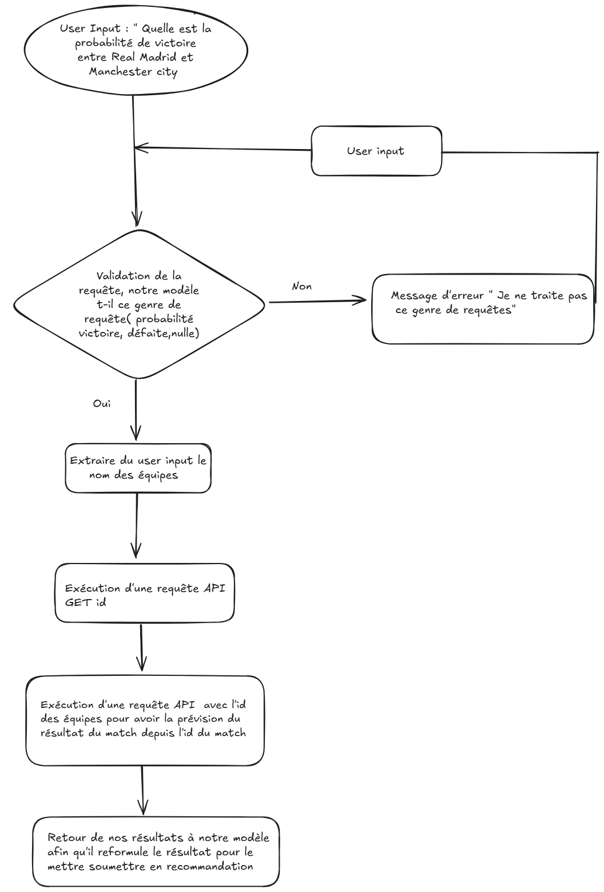

# 🎈 Blank app template

A simple Streamlit app template for you to modify!

[](https://blank-app-template.streamlit.app/)

### How to run it on your own machine

1. Install the requirements

   ```
   $ pip install -r requirements.txt
   ```

2. Run the app

   ```
   $ streamlit run streamlit_app.py
   ```


# Présentation 

Le projet consiste en la conception d’une intelligence artificielle générative capable de prédire les résultats des matchs de football en exploitant des modèles avancés d’apprentissage automatique et des données en temps réel. Grâce à l’intégration de modèles de langage (Gemini, LangChain) et d’algorithmes de machine learning (XGBoost, Random Forest, régression logistique), cette solution vise à fournir des analyses approfondies sur les performances des équipes et des joueurs, permettant ainsi d’améliorer la précision des prédictions et d’optimiser les stratégies de paris sportifs.

Le projet repose sur l’utilisation de Google Colab pour l’expérimentation et le prototypage, avec une éventuelle extension sous forme d’API Flask/FastAPI et de dashboard interactif avec Streamlit.

## Objectifs 

L’objectif principal est de développer une IA performante capable de :

- Prédire les résultats des matchs (Victoire/Nul/Défaite) en analysant des données historiques et en temps réel.
- Fournir des insights détaillés sur les facteurs influençant les performances des équipes et des joueurs.
- Automatiser le traitement des données sportives via des API fiables (Sofascore, API-Football, Football-data.org).
- Générer des recommandations stratégiques pour les analystes et les passionnés de paris sportifs.
- Visualiser et interpréter les prédictions à travers un tableau de bord interactif.
-Notifier les utilisateurs en temps réel grâce à un bot Telegram/Discord sur les opportunités de paris basées sur les prédictions IA.

## Architecture du projet 


Conception d'une AI générative permettant de prédire les résultats de rencontres sportives( football) 





### Spécification 

- utilisation de Google Collab avec des modèles de gemini et de lang-chain 

  #### Données pouvant etre récupérés via API :
- Statistiques détaillées des matchs
- Performances des équipes et joueurs
 -Historique des confrontations (H2H)
- Données en direct (buts, possession, tirs, xG…)
- Classements et historiques
- Calendrier des matchs
- Résultats historiques
- Cotes des bookmakers
- Données avancées sur les équipes


### Fonctionnalités 

- Fecth des données par requête API :


  ##### Sofascore
   https://www.sofascore.com/  --> version gratuite 1000 demandes à nous deux par mois 

  ##### API-Football
  https://www.api-football.com/


  ##### Football-data.org
  https://www.football-data.org/


  #### Traitement des données

  Nettoyage et vérification des données pour les mettre au même format

  #### Feature engineering

  - Création de variables comme la forme des équipes sur les 5 derniers matchs
  - Calcul des Expected Goals (xG)
  - Calcul des Expected Buteurs( en comptant son nombre de buts sur les 5 derniers matchs) 
  - Influence du facteur domicile/extérieur
  - Fusion des sources de données pour une analyse complète
  - Pour les côtes prendre la côte et en déterminé la probabilité --> cote à 2 = 0.5, cote à 4 = 0.25
    

### Implémentation 

Modèles traditionnels :

Régression logistique (Victoire/Nul/Défaite)
Random Forest & XGBoost (classification avancée)

#### Gemini sera utilisé pour générer des insights détaillés, comme :
- Explication des facteurs influençant une prédiction
- Recommandations sur les meilleures opportunités de paris
- Synthèse automatique des tendances des équipes

### Si possible 
- Développement d’une API Flask/FastAPI pour exposer les prédictions
- Dashboard interactif avec Streamlit pour visualiser les résultats
- Bot Telegram/Discord pour envoyer des notifications sur les prédictions

  https://www.omnicalculator.com/fr/sports/calculateur-pourcentage-victoires
  https://www.youtube.com/watch?v=DqGLELTbrqU
